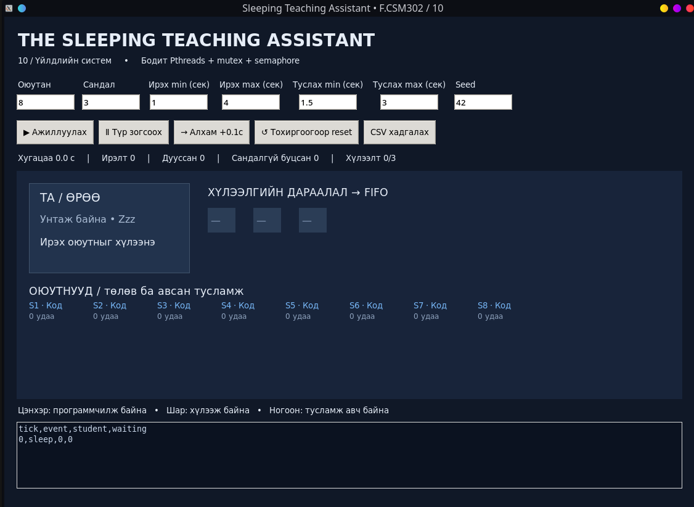
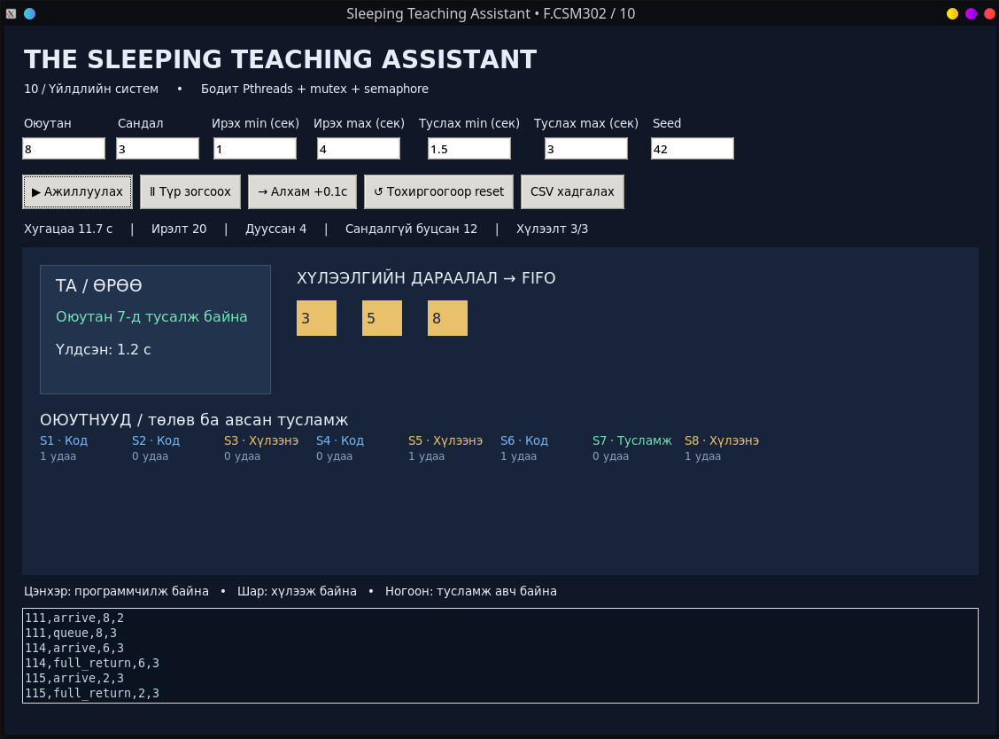
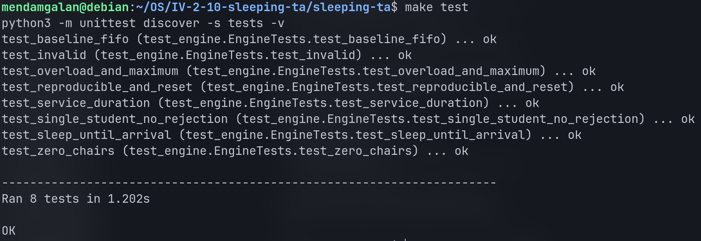

# 10 — The Sleeping Teaching Assistant
F.CSM302 Үйлдлийн систем • Бие даалт 1

## Хураангуй
TA нэг оюутанд үйлчилж байх үед бусад оюутан хязгаартай сандалд FIFO дарааллаар
хүлээнэ. Сандалгүй бол программчилж байгаад дахин ирнэ. C хөдөлгүүр нь бодит
Pthreads, mutex, semaphore ашиглана. Python UI хөдөлгүүрийн загварын цагийг удирдаж,
төлөвийг шууд уншина. Хөдөлгүүрийн 8 автомат тест амжилттай болсон.

---

  
> *Зураг 1: UI Үндсэн цонх харагдах байдал.*

---

  
> *Зураг 2: Программ ажиллаж буй байдал.*

---

  
> *Зураг 3: Test амжилттай гаралт.*

## 1. Зорилго, хамрах хүрээ
Харилцан үл хамаарах thread-үүдийн хамтын төлөвийг хамгаалах, унтаж байгаа
TA-г сэрээх, хүлээлгийн дарааллыг удирдахыг хэрэгжүүлнэ. Сандал, оюутны тоо,
ирэх болон туслах хугацааг солих боломжтой. CPU scheduler-ийн гүйцэтгэл хэмжихгүй.

## 2. Сурах бичгийн шаардлага
Оюутан бүр тусдаа thread; TA тусдаа thread. Хоосон үед TA унтана. Оюутны ирэлт
semaphore-аар сэрээнэ. TA завгүй бол сандалд сууна, дүүрсэн бол буцна.
Тусламжийн дараа дарааллын эхний оюутныг авна. Анхны 3 сандлыг тохируулж болно.
Санамсаргүй программчлах/үйлчлэх хугацааг sleep-ийн оронд 100 мс-ийн загварын
цагаар илэрхийлсэн; ингэснээр алхамчилсан UI бодит ажиллагааг удирдана.

## 3. Онол
`pthread_mutex_t mu` нь дараалал, оюутны төлөв, TA, тоолуурыг хамгаална.
`work` semaphore дээр сул TA блоклогдоно. Шууд ирсэн оюутан `sem_post(work)` өгнө.
`started` нь TA тусламж эхлүүлснийг ирсэн оюутанд баталгаажуулна.
`done[i]` нь тусламж дууссаныг тухайн оюутанд мэдээлнэ.
`ticks[i]`, `ta_tick`, `ack` нь удирдагч ба worker-ийн tick handshake.
Semaphore хүлээхдээ mutex барихгүй; ингэснээр нөгөө thread ажиллах боломжтой.

## 4. Зохиомж
Tkinter → ctypes → C хөдөлгүүр → TA болон n оюутны thread.
C snapshot → ctypes JSON decode → Tkinter дүрслэл.
UI дотроо дараалал, үйлчилгээний үр дүн зохиохгүй.
Оюутны төлөв: программчлах → хүлээх/тусламж → дууссан → программчлах.
TA төлөв: унтах → туслах → дараагийн оюутанд туслах эсвэл унтах.
FIFO нь 40 элементийн массив, бодит сандлын хязгаар 20.

## 5. Хэрэгжилт
`sim_init`: оролтыг шалгаж thread/semaphore-уудыг үүсгэнэ.
`student`: ирэх хугацаа болоход шууд сэрээх, дараалалд орох, эсвэл буцахыг шийднэ.
`teacher`: work дээр хүлээж, тусална; дуусахад done өгч FIFO-г үргэлжлүүлнэ.
`sim_step`: нэг tick-д эхлээд үйлчилгээ, дараа нь оюутны үйлдлүүдийг гүйцэтгүүлнэ.
`sim_snapshot`: mutex-ийн дор UI-д зориулсан тууштай snapshot гаргана.
`sim_close`: stop тавьж, блоклогдсон thread-үүдийг сэрээн join хийнэ.
Санамсаргүй тоо LCG; ижил seed, ижил тохиргоо яг ижил үйл явдлыг өгнө.

## 6. UI ба туршилтын арга
Run/Pause/Step/Reset, CSV экспорттой. Queue-ийн сандал бүр бодит массивын нэг
байрлал. TA хэсэг current болон remaining-ийг харуулна. Эхлээд baseline, дараа
нь 0 сандал, 1 оюутан, их ачаалал, хүчингүй оролт, reset нөхцөлийг шалгав.
Tick бүр: хүлээлт сандлаас хэтрэхгүй, давхардсан оюутангүй, TA хамгийн ихдээ
нэг оюутанд тусална, ирэлт = буцалт + дууссан + хүлээж буй + туслуулж буй.
FIFO-г үйл явдлын журналтай тулгаж шалгасан.

## 7. Бодит үр дүн
| Тест | Үр дүн |
|---|---|
| Baseline ба FIFO | PASS |
| 0 сандал | PASS |
| 1 оюутан, буцалтгүй | PASS |
| 40 оюутан, 20 сандал, их ачаалал | PASS |
| TA унтаж байгаад сэрэх | PASS |
| Seed давтагдах, reset | PASS |
| Буруу оролтыг татгалзах | PASS |
| Үйлчилгээ яг тохируулсан хугацаанд дуусах | PASS |

## 8. Хэлэлцүүлэг, дүгнэлт
UI нь загварын цаг болон C worker-үүдийг бодитоор удирдана. Алхам бүр бүрэн
дууссаны дараа snapshot уншдаг тул pause үед далд төлөв өөрчлөгдөхгүй.
Worker-үүд бодит thread боловч tick дотор үйлдлүүдийг дарааллаар зөвшөөрдөг:
энэ шийдэл сургалтын давтагдах туршилтад зориулагдсан. Чөлөөт OS scheduling-ийн
race илрүүлэх стресс тест гэж үзэхгүй. Сандалд орсон оюутан FIFO-оор үйлчлүүлнэ;
сандалгүй буцсан оюутанд хязгаартай хугацаанд заавал үйлчлэх баталгаа байхгүй.
CSV буферийн хэмжээ хязгаартай. 

## Ашигласан материал
- OS_BD1_Guide.pdf: өгсөн бие даалтын удирдамж.
- Operating System Concepts: Chapter 7 Project 2 — The Sleeping Teaching Assistant.
- AI тусламж: OpenAI ChatGPT — код, тест, баримт бичгийн боловсруулалт.
